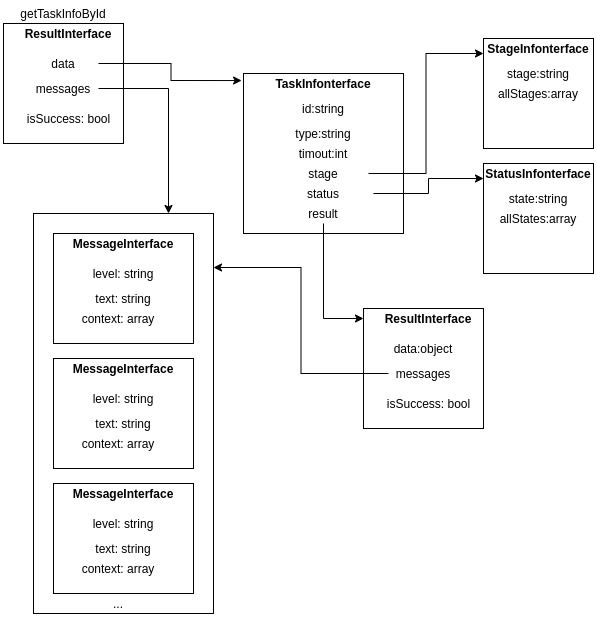

# Long term task
Разработаны общие [интерфейсы](../src/Callables/src/Task) по задачам которые не могут выполниться сразу.

Структура на примере метода getTaskInfoById:

Для лучшего понимания разработан пример реализации асинхронной задачи.

# Для лучшего понимания разработан пример реализации асинхронной задачи
## Задача
Записать в файл числа от 0 до **n**. Посчитать их сумму и записать ее в этот же файл.
Для имитации длительного выполнения, перед каждой файловой операцией добавить задержку в 1с.
## Входные параметры
**n** - целое, больше нуля.
## Результат
Сумма чисел.
## Стадии (stages) процесса
Прогресс задачи определен, как число, над записью которого в файл сейчас работает код.
## Ошибки
Передача **n**<1 - вызывает **reject** задачи

## Реализация
Классы [здесь](../src/Callables/src/TaskExample), тесты [здесь](../tests/src/Callables/TaskExample). 